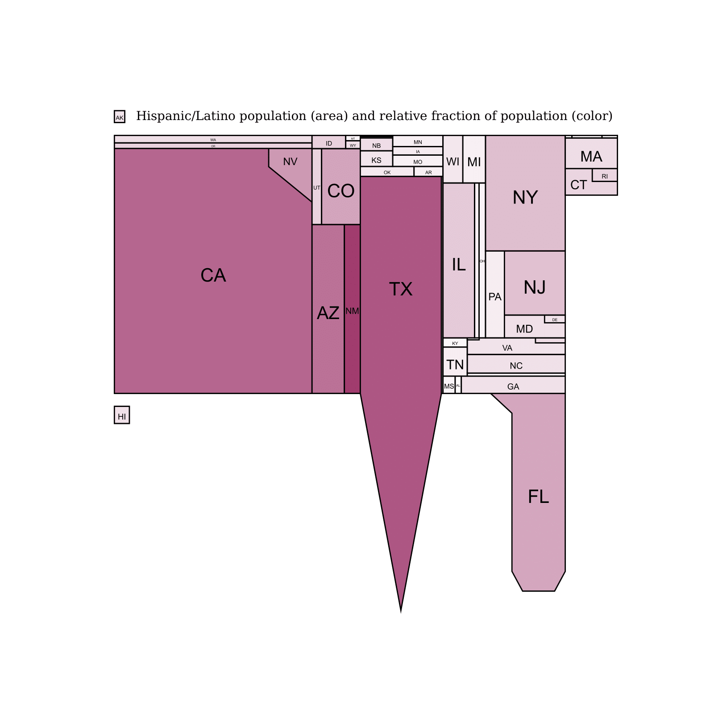
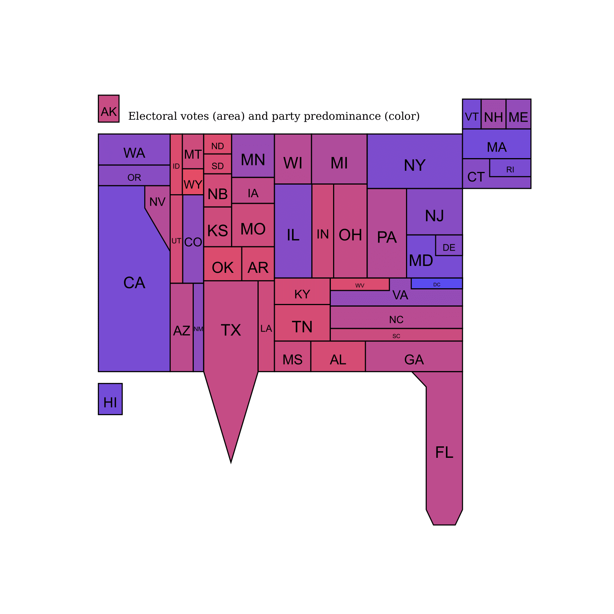

# UStreemap

**draw a distorted map of the U.S. with state areas and/or colors defined by data you provide**

## Introduction

In 2010, my Holiday Vacation project was an informal review paper on distorted maps -- their types and uses. You can find that paper [here](http://numrec.com/whp/notes/incomeinequality.pdf). For that paper, I wrote code to plot maps of the United States with the individual states distorted to show relative quantitative data. The "treemap" method was used. The code was in C++ and used the [Numerical Recipes](http://numerical.recipes) class library. Fun at the time, but not very accessible today.

This repository ports the code to Python with `matplotlib.pyplot` and verifies that it works also interactively in Jupyter. Most of the code translation was done by the Claude-2 Large Language Model, which could usually figure out on its own how to translate C++ classes to Python classes!

## Usage of `USmap()`

Input data always consists of text files with exactly 51 lines, each line containing exactly one number. The lines are in the alphabetical order of the 51 "states plus District of Columbia". The included file "state_names.txt" lists the states in the correct order. The included files "states_population.txt", "states_electoralvotes.txt", "states_hispanicpop", "states_pct_dems_2022.txt", and "states_pct_reps_2022.txt" are sample files in the required format.

The code builds up to the function
```
USmap(pg, xxl, xxr, yyb, yyt, r, g, b, vals, caption)`
```
This can be called directly to produce a map, output as a pyplot named (as usual) `plt`, but it is generally easier
to use one of the two wrappers provided -- see below.
In `USmap()` the arguments `r`, `g`, `b`, and `vals` are each lists of length 51 whose elements are the RGB colors of each state (as integers in the range 0 to 255 inclusive) and the values to which each state's area should be proportional. The arguments `xxl`, `xxr`, `xxt`, and `xxb` are respectively the left, right, top, and bottom plot coordinates of the map's bounding box. Good values are (50.0, 450.0, 250.0, 450.0). The argument `pg` is an instantiation of the internal class `PSpage` (in the C++ version this was a PostScript page!), initialized with code like this, modified to your taste,
```python
   fig, ax = plt.subplots(figsize=(8, 8))  
   plt.xticks([])
   plt.yticks([])
   ax.axis('off')
   pg = PSpage(ax)
```

## Usage of the wrappers `inextensive()` and `redblue()`

These wrappers do a bit of setup and then call `USmap()`.

The function name `inextensive()` stands for "intensive/extensive" meaning that two data lists are to be shown simultaneously, one controlling each state's area, the other controlling the intensity of its color. This is best illustrated by the example included as the files "treemap_example_1.(py,ipynb)" which contain,
```python
from treemap import *
inextensive("states_hispanicpop.txt","states_population.txt",
            "Hispanic/Latino population (area) and relative fraction of population (color)",
            160,60,110);
printme(plt,filename='hispanicpop.pdf')
```
This plots, and also saves as a PDF file, the result,<br>
<br>
Here, each state's area is proportional to the values in "states_hispanicpop.txt", while the state's color intensity is proportional to the ratio of those values to the values in "states_population.txt". The RGB value (160,60,110) defines the fully saturated color intensity.


The function `redblue()` generates the case where, instead of color intensity, a scale from red to blue is desired, with purple in the middle. (This is for political plots!) An example (files "treemap_example_2.(py,ipynb)"") is:
```python
from treemap import *
redblue("states_pct_reps_2022.txt","states_pct_dems_2022.txt","states_electoralvotes.txt",
    "Electoral votes (area) and party predominance (color)")
printme(plt,filename='red_blue_electoral_votes.pdf')
```
which takes files of percentages by state of Republicans and Democrats, ratios them on a red-blue scale, and plots states proportional in area to their number of electoral votes in the file "states_electoralvotes.txt". The result is<br>
<br>
Of course you can go into the code and customize anything! There are some customization switches buried in the code that even I don't remember how to use. You can ignore them, or make them do what you want.

## How to reference

Kindly reference any use of this code to the URL `github.com/whpress/UStreemap` as well as my 2010 paper,<br>
William H. Press, "U.S. Demographic Quantities Visualized by Cartographic Treemaps", (2010,
at http://numrec.com/whp/notes/USdistortedMaps.pdf ).


